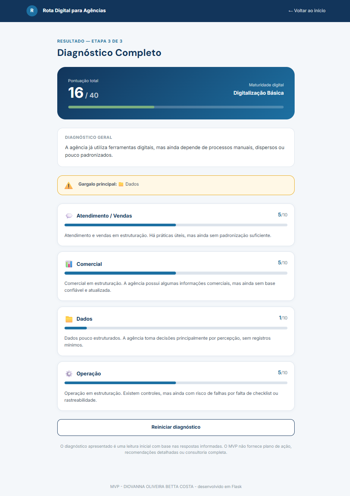

# Rota Digital para Agências

Aplicação web em **Python + Flask** que simula um diagnóstico inicial de transformação digital para pequenas agências de viagens.

O sistema avalia quatro áreas essenciais da operação de uma agência tradicional:

- Atendimento / Vendas
- Comercial
- Operação
- Dados

A partir das respostas do usuário, o sistema calcula uma pontuação interna, classifica o nível de maturidade digital e identifica o principal gargalo da agência.

---

## Preview do projeto





---

## Sobre o projeto

O **Rota Digital para Agências** é um MVP autoral desenvolvido para aplicar tecnologia, lógica de programação e visão de processos ao mercado de turismo.

A proposta do sistema é ajudar pequenas agências de viagens a refletirem sobre seu nível de organização digital e operacional, sem entregar uma consultoria completa.

O projeto foi pensado como uma ferramenta de diagnóstico inicial, com perguntas estratégicas sobre práticas de atendimento, vendas, relacionamento com fornecedores, operação de reservas e uso de dados.

---

## Objetivo

O objetivo do projeto é simular uma trilha inicial de diagnóstico para pequenas agências de viagens, identificando sinais de maturidade digital e possíveis gargalos operacionais.

O sistema busca responder à seguinte pergunta:

```text
Como uma pequena agência de viagens pode identificar seu estágio inicial de transformação digital de forma simples, estruturada e acessível?
```

---

## Público-alvo

O projeto foi pensado para:

- pequenas agências de viagens;
- agências tradicionais em processo de digitalização;
- agências familiares ou locais;
- consultores independentes que atuam como agência;
- equipes pequenas em que atendimento, vendas e operação se misturam.

Não é o foco inicial do MVP:

- grandes operadoras;
- OTAs;
- empresas com BI estruturado;
- agências com áreas altamente especializadas;
- empresas que já utilizam CRM, ERP, automações e dashboards avançados.

---

## Áreas avaliadas

### Atendimento / Vendas

Avalia como a agência recebe, qualifica, acompanha e tenta converter clientes.

Exemplos de pontos analisados:

- canal de origem do cliente;
- briefing de viagem;
- status do atendimento;
- follow-up;
- histórico do cliente.

---

### Comercial

Avalia a organização da agência em relação a fornecedores, parceiros, produtos e condições comerciais.

Exemplos de pontos analisados:

- base de fornecedores;
- condições comerciais;
- atualização de ofertas;
- comunicação entre comercial, vendas e operação;
- registro de problemas recorrentes com fornecedores.

---

### Operação

Avalia como a agência transforma uma venda em entrega real da viagem.

Exemplos de pontos analisados:

- checklist operacional;
- reservas;
- documentos;
- vouchers;
- conferência de informações;
- comunicação com fornecedores;
- suporte durante a viagem.

---

### Dados

Avalia se a agência registra informações mínimas para tomar decisões melhores.

Exemplos de pontos analisados:

- volume de contatos;
- propostas enviadas;
- propostas fechadas;
- propostas perdidas;
- motivos de perda;
- destinos mais procurados;
- problemas recorrentes por etapa.

---

## Funcionamento do sistema

O sistema possui um fluxo guiado:

```text
Tela inicial
↓
Questionário com 20 perguntas
↓
Resultado por área
↓
Pontuação geral + gargalo principal
↓
Diagnóstico completo
↓
Reinício do diagnóstico
```

Durante o questionário, o usuário responde uma pergunta por vez.

As opções disponíveis são:

```text
Não
Parcialmente
Sim
```

A pontuação não aparece durante o preenchimento, para não induzir as respostas.

---

## Experiência do usuário

O projeto foi desenvolvido com atenção à usabilidade.

Algumas decisões de interface:

- uma pergunta por tela;
- barra de progresso;
- indicação da pergunta atual;
- exibição da área avaliada;
- critérios específicos em cada pergunta;
- pontuação exibida somente ao final;
- resultado dividido em etapas;
- tela de confirmação antes de reiniciar;
- aviso de que o diagnóstico é inicial e não substitui consultoria completa.

---

## Modelo de pontuação

Cada resposta possui uma pontuação interna:

| Resposta | Pontuação interna |
|---|---:|
| Não | 0 |
| Parcialmente | 1 |
| Sim | 2 |

Essa pontuação é usada apenas pelo sistema.

O usuário não vê os pontos durante o questionário.

Cada área possui 5 perguntas:

```text
5 perguntas x 2 pontos = 10 pontos por área
```

Pontuação total:

```text
4 áreas x 10 pontos = 40 pontos
```

---

## Interpretação por área

Cada área recebe uma pontuação de 0 a 10.

| Pontuação | Interpretação |
|---:|---|
| 0 a 3 | Área pouco estruturada |
| 4 a 6 | Área em estruturação |
| 7 a 8 | Área organizada |
| 9 a 10 | Área bem estruturada |

---

## Interpretação geral

A pontuação total define o nível de maturidade digital da agência.

| Pontuação total | Nível de maturidade digital |
|---:|---|
| 0 a 10 | Presença Digital Inicial |
| 11 a 20 | Digitalização Básica |
| 21 a 30 | Operação Digital em Estruturação |
| 31 a 40 | Gestão Digital Organizada |

---

## Gargalo principal

O sistema identifica como gargalo principal a área com menor pontuação.

Em caso de empate, é aplicada uma regra de desempate definida no escopo do MVP:

```text
1. Atendimento / Vendas
2. Operação
3. Comercial
4. Dados
```

Essa ordem considera o impacto direto das áreas na entrada de receita, entrega da viagem e evolução digital da agência.

---

## Perguntas do diagnóstico

O questionário possui 20 perguntas estratégicas, divididas em 4 áreas.

### Atendimento / Vendas

1. A agência registra por qual canal cada cliente chegou?
2. Existe um roteiro mínimo de perguntas para entender o perfil da viagem antes de montar a proposta?
3. Os atendimentos são organizados por status, como novo contato, em cotação, proposta enviada, aguardando retorno, fechado ou perdido?
4. Existe uma rotina de follow-up para clientes que receberam proposta e ainda não responderam?
5. O histórico do cliente fica registrado em algum lugar acessível?

### Comercial

6. A agência possui uma lista organizada de fornecedores, parceiros, operadoras, hotéis, receptivos ou prestadores usados com frequência?
7. As condições comerciais dos fornecedores ficam registradas, como comissão, prazo, regras, contatos e condições de cancelamento?
8. Existe um processo para atualizar produtos, pacotes, tarifários ou ofertas antes de repassar informações para atendimento/vendas?
9. As informações negociadas pelo comercial chegam de forma clara para quem vende e para quem opera a viagem?
10. A agência registra problemas recorrentes com fornecedores, como atrasos, divergências, baixa qualidade ou falhas de comunicação?

### Operação

11. Após a venda, existe um checklist para acompanhar o que precisa ser confirmado antes da viagem?
12. A agência acompanha o status de reservas, confirmações, documentos, vouchers e pendências em algum lugar organizado?
13. Existe conferência das informações principais antes do envio ao cliente, como nomes, datas, horários, serviços, contatos, valores e regras?
14. A comunicação com fornecedores durante a operação fica registrada de forma acessível para a equipe?
15. Existe algum fluxo definido para lidar com problemas durante a viagem, como hotel, transfer, passeio, voo, atraso ou emergência?

### Dados

16. A agência registra quantos contatos ou pedidos de orçamento recebe em determinado período?
17. A agência acompanha quantas propostas foram enviadas, fechadas ou perdidas?
18. A agência registra os principais motivos de perda de venda?
19. A agência sabe quais destinos, produtos ou tipos de viagem são mais procurados pelos clientes?
20. A agência registra problemas recorrentes por etapa do processo, como atendimento, comercial, fornecedor, documentação, reserva, operação ou pós-venda?

---

## Funcionalidades

- Tela inicial de apresentação do MVP;
- Questionário com 20 perguntas;
- Exibição de uma pergunta por vez;
- Barra de progresso;
- Critérios específicos por pergunta;
- Respostas categóricas: Não, Parcialmente e Sim;
- Pontuação interna das respostas;
- Armazenamento temporário das respostas com `session`;
- Cálculo de pontuação por área;
- Cálculo de pontuação total;
- Classificação de maturidade digital;
- Identificação do gargalo principal;
- Resultado dividido em três etapas;
- Tela de confirmação antes de reiniciar o diagnóstico;
- Reinício do fluxo com limpeza da sessão.

---

## Tecnologias utilizadas

- Python
- Flask
- HTML
- CSS
- Bootstrap
- Jinja
- Session do Flask

---

## Conceitos praticados

Este projeto aplica conceitos de programação, desenvolvimento web e engenharia de software.

### Programação e Python

- variáveis;
- listas;
- dicionários;
- dicionários aninhados;
- funções;
- `if`, `elif` e `else`;
- `for`;
- `return`;
- soma de pontuações;
- comparação de valores;
- regra de desempate.

### Flask

- criação de aplicação web;
- rotas;
- templates;
- envio de formulário com método `POST`;
- redirecionamento de rotas;
- uso de `url_for`;
- uso de `session`;
- renderização de páginas HTML com dados do Python.

### Front-end

- HTML semântico;
- CSS próprio;
- Bootstrap para estrutura visual;
- cards;
- botões;
- barra de progresso;
- responsividade básica;
- organização visual do fluxo.

### Engenharia de Software

- definição de escopo;
- requisitos funcionais;
- requisitos não funcionais;
- regra de negócio;
- critérios de aceite;
- fluxo de uso;
- MVP;
- foco em usabilidade;
- separação entre diagnóstico inicial e consultoria completa.

---

## Estrutura do projeto

```text
rota_digital_agencias/
│
├── app.py
├── requirements.txt
├── .gitignore
├── README.md
│
├── static/
│   └── style.css
│
├── templates/
│   ├── index.html
│   ├── diagnostico.html
│   ├── resultado.html
│   └── confirmar_reinicio.html
│
└── assets/
    ├── tela-inicial.png
    └── diagnostico-completo.png
```

---

## Como acessar

### Versão online

Acesse:

https://rota-digital-agencias.onrender.com/

### Versão local

Para rodar o projeto localmente, siga os passos abaixo:

Para executar o sistema, é necessário ter o Python instalado.

### 1. Clone o repositório

```bash
git clone https://github.com/diobetta/rota_digital_agencias.git
```

### 2. Acesse a pasta do projeto

```bash
cd rota_digital_agencias
```

### 3. Crie o ambiente virtual

```bash
py -m venv .venv
```

### 4. Ative o ambiente virtual

No Git Bash:

```bash
source .venv/Scripts/activate
```

No PowerShell:

```bash
.venv\Scripts\Activate.ps1
```

### 5. Instale as dependências

```bash
pip install -r requirements.txt
```

### 6. Execute o projeto

```bash
python app.py
```

Caso esteja usando Windows e o comando acima não funcione, tente:

```bash
py app.py
```

### 7. Acesse no navegador

```text
http://127.0.0.1:5000
```

---

## Rotas do sistema

| Rota | Função |
|---|---|
| `/` | Tela inicial e limpeza da sessão |
| `/diagnostico` | Exibe uma pergunta por vez e salva respostas |
| `/resultado/areas` | Mostra pontuação e diagnóstico por área |
| `/resultado/geral` | Mostra pontuação total, maturidade e gargalo |
| `/resultado/completo` | Mostra o diagnóstico completo |
| `/confirmar-reinicio` | Exibe aviso antes de apagar o progresso |
| `/reiniciar` | Limpa a sessão e reinicia o diagnóstico |

---

## Testes realizados

Foram testados os seguintes fluxos:

```text
Abertura da tela inicial
Início do diagnóstico
Exibição da pergunta atual
Exibição da barra de progresso
Tentativa de continuar sem resposta
Exibição de mensagem de erro
Registro de resposta na session
Avanço entre perguntas
Finalização das 20 perguntas
Cálculo da pontuação por área
Cálculo da pontuação total
Classificação de maturidade digital
Identificação do gargalo principal
Aplicação da regra de desempate
Exibição do resultado por área
Exibição do resultado geral
Exibição do diagnóstico completo
Tela de confirmação antes de reiniciar
Limpeza da session ao reiniciar
Retorno para a tela inicial
```

---

## Critérios de aceite

| Código | Critério |
|---|---|
| CA01 | O sistema deve iniciar na tela inicial. |
| CA02 | Ao clicar em “Iniciar diagnóstico”, o usuário deve acessar o questionário. |
| CA03 | O sistema deve exibir uma pergunta por vez. |
| CA04 | O sistema deve mostrar a área avaliada da pergunta. |
| CA05 | O sistema deve mostrar barra de progresso. |
| CA06 | O sistema não deve mostrar pontuação durante o questionário. |
| CA07 | O sistema deve exigir uma resposta antes de avançar. |
| CA08 | O sistema deve salvar temporariamente as respostas na session. |
| CA09 | Ao final das 20 perguntas, o sistema deve calcular o resultado. |
| CA10 | Cada área deve ter pontuação máxima de 10 pontos. |
| CA11 | A pontuação total deve ter valor máximo de 40 pontos. |
| CA12 | O sistema deve identificar corretamente o nível de maturidade digital. |
| CA13 | O sistema deve identificar corretamente o gargalo principal. |
| CA14 | Em caso de empate, o sistema deve aplicar a regra de desempate definida. |
| CA15 | O resultado deve aparecer em etapas. |
| CA16 | O sistema deve pedir confirmação antes de apagar o progresso. |
| CA17 | Ao reiniciar, a session deve ser limpa. |
| CA18 | O sistema não deve exibir plano de ação ou consultoria detalhada. |

---

## Fora do escopo

Este MVP não possui:

- login;
- cadastro real de agência;
- banco de dados;
- dashboard administrativo;
- salvamento de histórico;
- exportação em PDF;
- envio por e-mail;
- integração com WhatsApp;
- integração com Instagram;
- integração com Google;
- IA generativa;
- análise automática de site;
- plano de ação detalhado;
- recomendações por área;
- consultoria completa;
- módulo financeiro;
- módulo administrativo;
- precificação avançada.

Essas exclusões são intencionais para manter o projeto dentro do escopo de MVP e preservar seu foco como simulador inicial.

---

## Decisão de produto

O projeto foi desenhado para entregar valor sem ultrapassar o limite de um MVP.

A versão atual entrega:

```text
diagnóstico inicial
pontuação por área
pontuação geral
nível de maturidade digital
identificação de gargalo
leitura consolidada do cenário
```

A versão atual não entrega:

```text
plano de ação
roteiro de implantação
modelos prontos de processo
consultoria completa
recomendações detalhadas
```

Essa decisão foi tomada para manter o produto simples, objetivo e estrategicamente limitado.

---

## Melhorias futuras

Possíveis evoluções para uma versão futura:

- adicionar cadastro de agência;
- salvar diagnósticos anteriores;
- gerar relatório em PDF;
- criar painel de evolução;
- permitir comparação entre diagnósticos;
- exibir gráficos;
- adicionar recomendações por área;
- sugerir plano de ação;
- criar versão com login;
- criar banco de dados;
- incluir trilhas de transformação digital;
- criar versão comercial do produto;
- publicar o MVP em ambiente online.

---

## Status do projeto

```text
MVP funcional em desenvolvimento para portfólio.
```

O projeto foi criado como uma peça de vitrine para demonstrar aplicação prática de programação, processos, produto e conhecimento do mercado de turismo.

---

## Autoria

Desenvolvido por **Diovanna Oliveira Betta Costa**, estudante de Análise e Desenvolvimento de Sistemas.

Projeto autoral criado para aplicar conhecimentos de programação, engenharia de software, processos e produto ao contexto de pequenas agências de viagens.